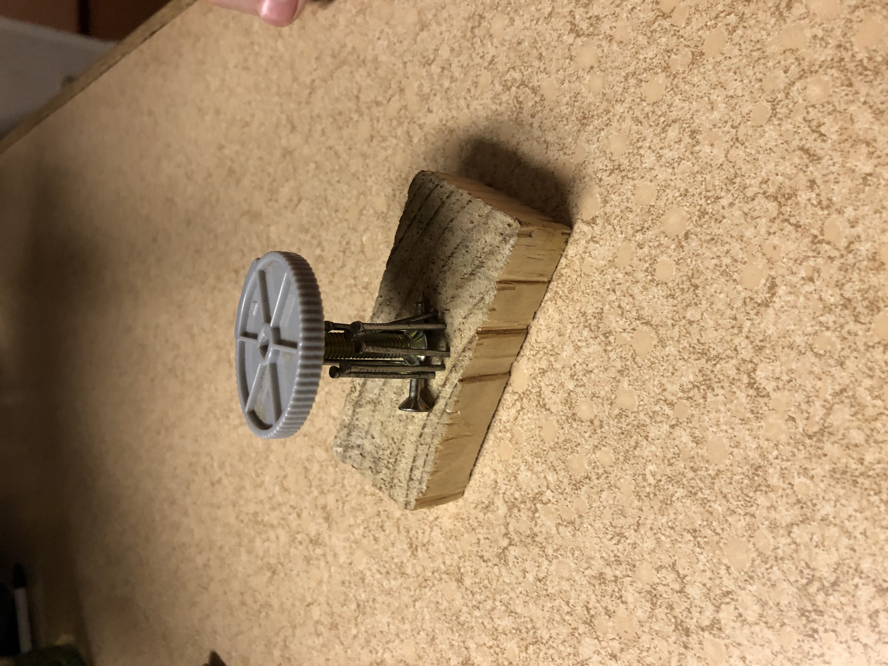
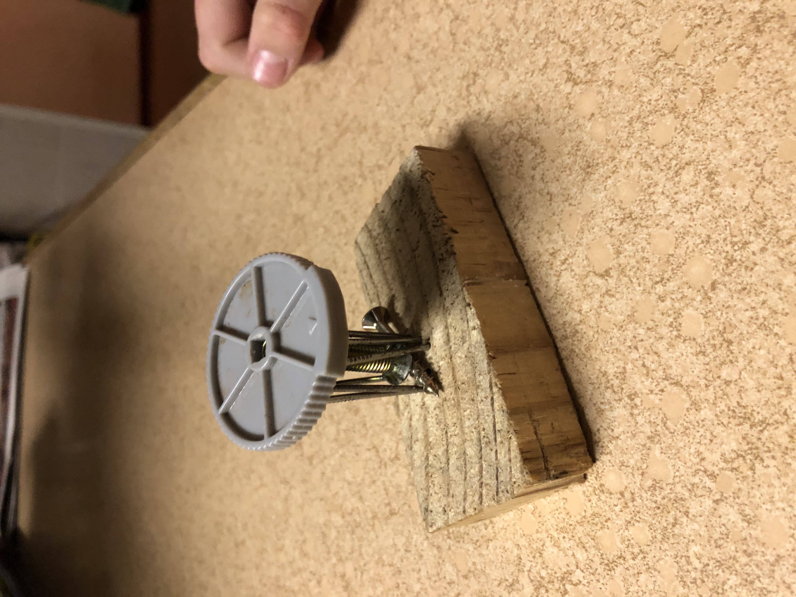

# Move and Place
It turns stuff. It can rotate it. It can lift it. It can place it down. The screw makes it go up, down, left, right.

|       Field | Value             |
|------------:|-------------------|
|   **Title** | Move and Place    |
|     **Key** | INVENTION-1       |
| **Created** | 27/Jul/19 9:36 AM |
